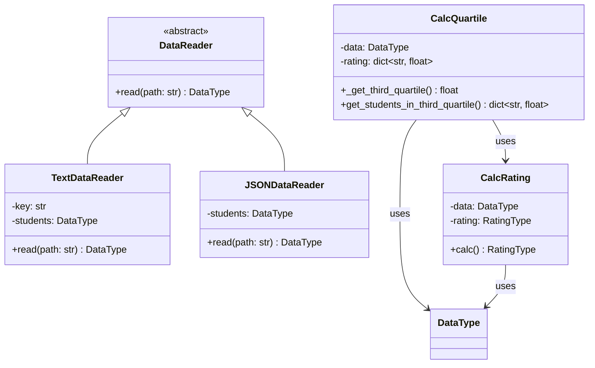

# Лабораторная 1 по дисциплине "Технологии программирования"
## Постановка задачи

Проект рассчитывает средний рейтинг студентов по дисциплинам.
Данные о студентах и их оценках хранятся в текстовых файлах (формат .txt)
или JSON-файлах. Дополнительно реализован расчёт студентов, чей рейтинг
попадает в третью квартиль распределения.

## Вариант 11

- Формат входного файла: **JSON**
- Расчётная процедура: **определить и вывести студентов, чей рейтинг
  попадает в третью квартиль распределения по рейтингам**

## Структура проекта
```
rating 
  |----.github 
  |     |----workflows 
  |           |----github-actions-testing.yml 
  | 
  |----data 
  |     |----data.txt
  |     |----data.json 
  | 
  |----src 
  |     |----CalcRating.py 
  |     |----DataReader.py 
  |     |----TextDataReader.py
  |     |----JSONDataReader.py
  |     |----CalcQuartile
  |     |----Types.py 
  |     |----main.py 
  | 
  |----test 
  |     |----test_CalcRating.py 
  |     |----test_TextDataReader.py
  |     |----test_JSONDataReader.py
  |     |----test_CalcQuartile.py
  |     |----test_main.py 
  | 
  |----README.md 
  |----requirements.txt
  |----.gitignore
  |----LICENSE
```
## Используемые технологии

- Python 3.10
- pytest — модульное тестирование
- pycodestyle — проверка стиля (PEP8)
- json — чтение JSON-файлов (стандартная библиотека)
- GitHub Actions — CI

## UML-диаграмма классов



## Лицензия

MIT License — см. файл LICENSE.

## Выводы

В ходе работы были изучены принципы модульного тестирования,
непрерывной интеграции (GitHub Actions), работа с ветками Git,
а также применение принципов SOLID и паттернов проектирования
(в частности, использование абстрактного класса DataReader
для поддержки разных форматов входных файлов).
